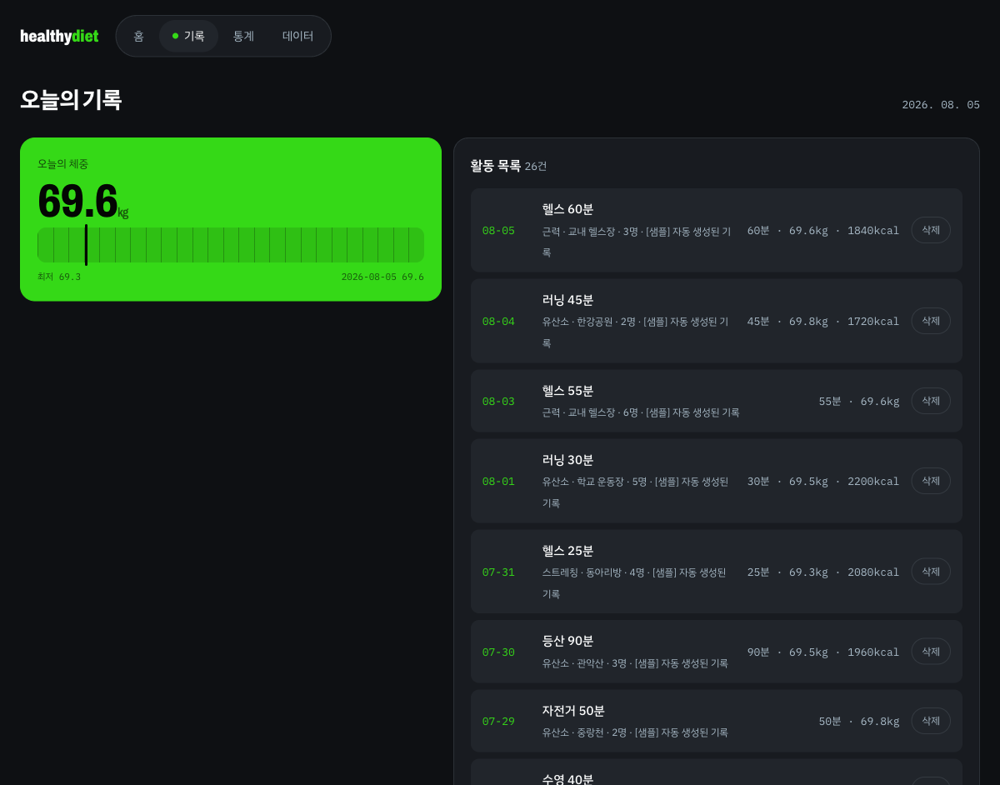
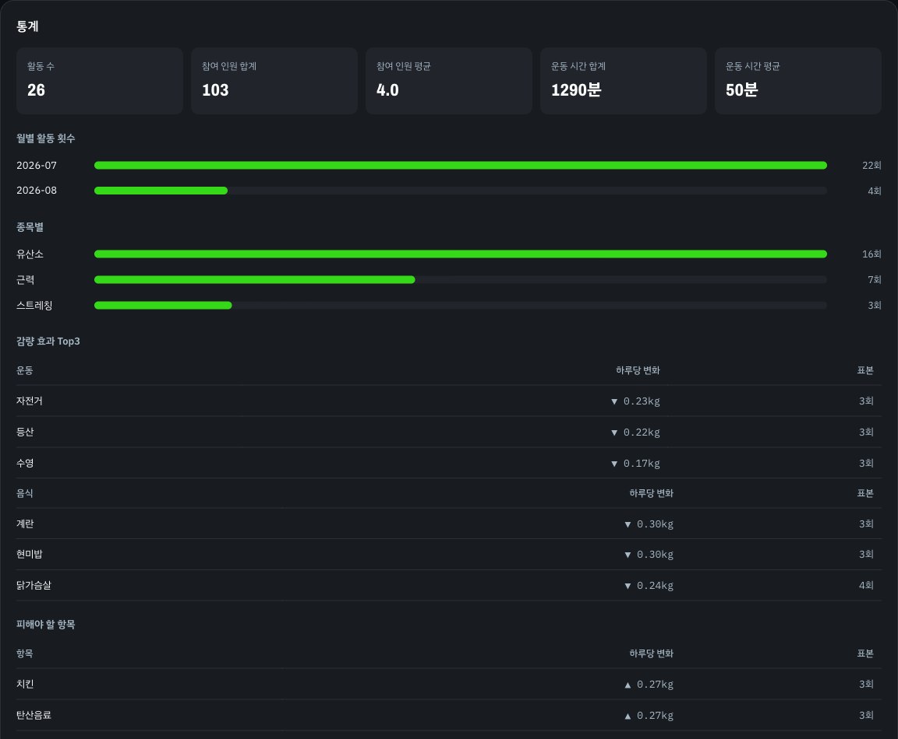

# 다이어트 동아리 활동 기록 관리 웹앱

한 달치 기록에서 **내 몸에 실제로 효과가 있었던 음식과 운동**을 찾아내는 웹앱.

- 팀: 1팀 / schoolLover
- 저장소: https://github.com/bongjunpyo/hackathon1schoolLover
- 2026 해커톤 과제 "동아리 활동 기록 관리 웹앱"

---

## 1. 개발 배경

다이어트 동아리에서 활동 기록은 계속 쌓인다. 그런데 정작 중요한 질문에는 아무도 답하지 못한다.

> "지난 한 달 동안 내가 살이 빠진 건, **뭘 해서** 빠진 거지?"

기존 기록 앱은 "무엇을 했는가"까지만 남긴다. 러닝 20회, 헬스 15회, 총 1,200분. 숫자는 많은데
**그중 어떤 게 실제로 체중을 움직였는지**는 알 수 없다. 사람마다 반응하는 운동과 음식이 다른데,
남들이 좋다는 걸 그대로 따라 하게 되는 이유가 이것이다.

이 앱은 그 질문에 답한다. 기록을 쌓는 데서 끝내지 않고,

1. **날짜별 체중 변화를 그날의 운동·음식에 귀속**시켜
2. 항목별 평균 변화량으로 **감량 효과 순위**를 매기고
3. 효과가 있었던 Top3와 **피해야 할 항목**을 분리해서 보여준다

"닭가슴살을 먹은 날은 하루 평균 -0.115kg" 처럼, 내 데이터로 검증된 문장을 만드는 것이 목표다.

### 왜 localStorage인가

과제 명세가 서버·DB·빌드 도구를 금지한다. 그래서 브라우저 localStorage 하나에 저장한다.
제약이지만 이 앱에는 맞는 선택이기도 하다. 체중과 식단은 민감한 개인 정보고,
서버로 보내지 않으면 유출될 곳이 없다.

---

## 2. 팀원과 역할

| 이름 | 역할 | 담당 파일 |
|---|---|---|
| 이동제 | 프론트엔드 / 디버깅 / 유지보수 | `index.html`, `style.css`, `js/ui/` |
| 박효민 | 데이터 계층 / 디버깅 / 유지보수 | `js/store/` |
| 봉준표 | 데이터 처리 / 디버깅 / 유지보수 | `js/analytics/` |

명세서가 서버·DB를 금지하므로 이 프로젝트에 **"백엔드" 역할은 존재하지 않는다.**
데이터를 다루는 두 사람이 각각 저장(데이터 계층)과 계산(데이터 처리)을 맡는다.

---

## 3. 실행 방법

설치도 빌드도 서버도 없다.

```bash
git clone https://github.com/bongjunpyo/hackathon1schoolLover.git
cd hackathon1schoolLover
```

`index.html`을 크롬으로 연다. 더블클릭하거나:

```bash
open index.html          # macOS
start index.html         # Windows
```

**처음 열면 기록이 0건이라 통계 화면이 비어 있다.**
`샘플 데이터 생성` 버튼을 누르면 최근 30일치가 만들어지고 모든 분석 기능을 볼 수 있다.

### 주의

- `type="module"`을 쓰지 않는다. `file://`에서는 ES 모듈이 CORS로 차단돼 화면이 백지가 된다.
  일반 `<script>` 태그를 순서대로 넣고 전역 객체로 노출한다.
- 크롬은 `file://` 문서들의 localStorage를 공유한다. 폴더 사본을 여러 개 두고 테스트하지 않는다.

---

## 4. 실행 화면

<!-- TODO: 스크린샷 2장 이상 첨부. 제출 필수 요건. -->

| 화면 | 설명 |
|---|---|
|  | 활동 등록 폼과 최신순 목록 |
|  | 체중 추이, 월별 활동 횟수, 감량 효과 Top3 |

---

## 5. 구현 기능

### 필수 기능 (명세서 요구)

| 기능 | 설명 |
|---|---|
| 활동 등록 | 활동명, 날짜, 장소, 참여 인원, 메모를 입력해 저장 |
| 활동 목록 조회 | 최신순 정렬. 기록이 없으면 안내 문구 표시 |
| 활동 삭제 | 개별 삭제. 삭제 전 확인 절차 |

**입력값 검증**

- 활동명이 비어 있으면 저장하지 않는다
- 미래 날짜는 저장하지 않는다
- 참여 인원은 1 이상의 정수만 허용한다 (`0`, 음수, 소수, 공백 모두 거부)

### 선택 기능 (명세서 목록에서 선택)

| 명세서 항목 | 구현 |
|---|---|
| 월별 활동 횟수 통계 차트 | `Analytics.monthlyCount()` |
| 참여 인원 합계 및 평균 표시 | `Analytics.summary()` |
| 반응형 레이아웃 | `style.css` |
| 데이터 JSON 내보내기 / 가져오기 | `Store.exportJson()` / `Store.importJson()` |
| 활동명·장소 키워드 검색 | 시간이 남으면 추가 |

### 확장 기능 (명세서 목록 밖, 차별화)

| 기능 | 설명 |
|---|---|
| 체중 추이 | 체중 기록을 날짜순 시계열로 표시 |
| 칼로리 수지 | 섭취 - 소모(추정치). 소모는 `분 x 카테고리별 계수` |
| **감량 효과 Top3** | 음식·운동별 하루당 체중 변화를 계산해 순위를 매긴다 |
| **회피 항목** | 오히려 체중이 늘어난 음식·운동을 분리해서 보여준다 |
| 날씨 기반 계획 | 앞으로 7일 예보에 Top3 운동을 배치. [이슈 #2](../../issues/2)에서 B-2로 연기 |

---

## 6. 데이터 아키텍처

### 계층 구조

세 계층이 한 방향으로만 의존한다. 이 방향이 세 명이 동시에 작업할 수 있는 근거다.

```
+---------------------------------------------------------+
|  index.html / style.css / js/ui/ui.js        [동제]      |
|  화면 렌더링, 이벤트 처리, 사용자 확인                    |
+---------------------------------------------------------+
        |                                |
        | Store.*                        | Analytics.*
        v                                v
+----------------------------+  +------------------------------+
|  js/store/store.js [효민]  |  |  js/analytics/               |
|  localStorage 읽고 쓰기    |  |    analytics.js     [준표]   |
|  스키마 / 검증 / 샘플 생성 |  |  순수 계산 함수              |
+----------------------------+  +------------------------------+
        |                                ^
        v                                |
+----------------------------+           |
|  localStorage              |  Activity[] 를 인자로 받는다
|  key: "activities"         |-----------+
+----------------------------+
```

**경계 규칙 3줄**

- `ui.js`는 localStorage를 직접 만지지 않는다. 항상 `Store`를 거친다
- `analytics.js`는 DOM도 localStorage도 만지지 않는다. 배열을 받아 값을 돌려줄 뿐이다
- `store.js`는 화면을 모른다. 에러를 `alert`하지 않고 `errors` 객체로 돌려준다

`analytics.js`가 저장소를 모르기 때문에, `store.js`가 없어도 배열만 직접 만들어 테스트할 수 있다.
실제로 개발 중 세 사람이 서로를 기다리지 않고 동시에 작업했다.

### 저장 형식

localStorage 키 하나에 JSON 배열로 통째 저장한다.

```
localStorage["activities"] = '[{...}, {...}, ...]'
```

레코드가 수백 건 수준이라 인덱스나 정규화가 필요 없다. 읽을 때 전체를 파싱하고,
쓸 때 전체를 직렬화한다. 단순한 대신 저장 책임이 `store.js` 한 파일에 모인다.

### 스키마

활동 1건의 형태다. 명세서 고정 필드는 이름을 바꾸거나 지우지 않고, 확장 필드만 덧붙인다.

```js
{
  // --- 명세서 고정 필드 ---
  id,           // string   Store가 발급. UI가 넘기지 않는다
  title,        // string   활동명. 필수
  date,         // string   'YYYY-MM-DD'. 미래 날짜 거부
  place,        // string   장소
  memberCount,  // number   참여 인원. 1 이상 정수
  memo,         // string   메모
  createdAt,    // string   ISO 문자열. Store가 발급

  // --- 확장 필드 ---
  category,     // '유산소' | '근력' | '스트레칭'
  durationMin,  // number         운동 시간(분). 1 이상 정수
  weightKg,     // number | null  당일 체중. 미입력 null
  kcalIn,       // number | null  당일 섭취 칼로리. 미입력 null
  exercise,     // string | null  '러닝'|'헬스'|'수영'|'자전거'|'등산'
  foods         // string[]       체크박스로 고른 음식. 미입력은 [] (null 아님)
}
```

**설계상 중요한 결정 세 가지**

1. **미입력은 `null`로 통일한다.** `undefined`는 `JSON.stringify`에서 키째 사라져
   내보내기 → 가져오기 왕복에 필드 유무가 달라진다.
2. **빈 문자열은 `0`이 아니라 미입력이다.** `Number('')`는 `0`이라 그냥 넘기면
   체중 0kg가 저장되고 평균 계산이 무너진다.
3. **`exercise`와 `foods`는 선택형 입력으로만 받는다.** 랭킹의 집계 키이기 때문에
   자유 텍스트면 "닭가슴살"과 "닭 가슴살"이 다른 항목이 돼 순위가 무너진다.

`foods`만 `null` 대신 `[]`를 쓴다. `analytics.js`가 `a.foods || []`로 읽고 있어 배열로 통일하는 편이 일관된다.

---

## 7. CRUD

모든 데이터 변경은 `Store`를 통과한다. UI가 localStorage를 직접 건드리는 경로는 없다.

### Create — `Store.add(input)`

```
사용자 입력
  -> validate(input)        검증 실패 시 { ok: false, errors } 로 즉시 반환
  -> buildActivity(input)   id 발급, createdAt 기록, 타입 정규화
  -> 기존 목록 + 새 항목
  -> write(list)            localStorage 에 전체 직렬화
  -> { ok: true, activity }
```

```js
const result = Store.add({
  title: '러닝 5km', date: '2026-08-05', place: '한강공원',
  memberCount: 4, memo: '', category: '유산소', durationMin: 45,
  weightKg: 68.4, kcalIn: 1800, exercise: '러닝', foods: ['닭가슴살', '샐러드'],
});

if (!result.ok) showErrors(result.errors);
// errors 예시: { memberCount: '참여 인원은 1명 이상이어야 합니다' }
```

`id`와 `createdAt`은 **Store가 만든다.** UI가 넘기지 않는다. 검증을 통과하지 못하면 저장이 일어나지 않는다.

### Read — `Store.getAll()`

```
localStorage 파싱      깨진 JSON 이면 빈 배열
  -> createdAt 내림차순 정렬
  -> Activity[]
```

목록 조회, 통계, 랭킹이 전부 이 배열 하나에서 나온다. `Analytics.*`는 이 배열을 인자로 받는다.

### Update

**활동 수정 기능은 구현하지 않았다.** 명세서 선택 기능이지만 우선순위에서 밀렸다.
잘못 입력하면 삭제 후 다시 등록한다.

### Delete — `Store.remove(id)`

```
확인창 (UI 담당)
  -> 목록에서 해당 id 제외
  -> 길이가 줄었는지 확인    없는 id 면 false
  -> write(list)
  -> true
```

명세서가 "삭제 전 확인 절차"를 요구한다. 확인창은 UI가 띄우고, `Store`는 화면을 모른 채 삭제만 한다.

### 부가 연산

| 함수 | 설명 |
|---|---|
| `Store.clearAll()` | 전체 삭제 |
| `Store.seedSampleData()` | 최근 30일치 샘플 생성. 생성 건수 반환 |
| `Store.exportJson()` | JSON 문자열로 내보내기 |
| `Store.importJson(text)` | JSON 가져오기. `add`와 같은 검증에 태우고 통과 못 한 건 `skipped`로 센다 |

---

## 8. 파일 구조

```
hackathon1schoolLover/
├── index.html                  화면 구조. script 로드 순서를 여기서 정한다
├── style.css                   스타일, 반응형 레이아웃
├── README.md                   이 문서
├── CLAUDE.md                   세 명 공통 계약 (스키마, 인터페이스, 경계 규칙)
├── docs/
│   ├── 설계서.md               설계 결정 기록
│   └── AI_USAGE.md             Claude Code 위임 내역과 검증 방법
└── js/
    ├── store/
    │   ├── store.js            [효민] localStorage 접근, 스키마, 검증, 샘플 생성
    │   └── CLAUDE.md           데이터 계층 담당 규칙
    ├── analytics/
    │   ├── analytics.js        [준표] 순수 계산 함수. 통계와 감량 효과 랭킹
    │   ├── recommend.js        [준표] 날씨 기반 계획 (B-2 대기)
    │   └── CLAUDE.md           데이터 처리 담당 규칙
    └── ui/
        ├── ui.js               [동제] 렌더링, 이벤트, 사용자 확인
        └── CLAUDE.md           프론트엔드 담당 규칙
```

### 각 파일이 하는 일

**`index.html`** — 화면 뼈대와 스크립트 로드 순서. 순서가 중요하다.

```html
<script src="js/store/store.js"></script>          <!-- 1. 저장소 -->
<script src="js/analytics/analytics.js"></script>  <!-- 2. 계산 -->
<script src="js/ui/ui.js"></script>                <!-- 3. 화면. 위 둘을 쓴다 -->
```

**`js/store/store.js`** — 이 앱에서 **유일하게 localStorage를 만지는 파일.**
저장 형식이 바뀌어도 여기만 고치면 된다. 스키마와 검증 규칙이 전부 여기 산다.
`Store` 전역 객체로 노출한다.

**`js/analytics/analytics.js`** — **전부 순수 함수.** 인자로 받은 배열만 읽고,
아무것도 바꾸지 않고, 값을 돌려준다. DOM도 localStorage도 모른다.
그래서 `store.js`가 없어도 배열을 직접 만들어 테스트할 수 있다.
`Analytics` 전역 객체로 노출한다.

**`js/analytics/recommend.js`** — 날씨 API를 붙여 앞으로 7일 계획을 만든다.
외부 네트워크에 의존하고 `async`라 나머지와 성격이 달라, [이슈 #2](../../issues/2) 결정에 따라
필수 기능이 끝난 뒤에 합류시키기로 했다. `Recommend` 전역 객체로 노출한다.

**`js/ui/ui.js`** — 화면을 그리고 이벤트를 받는다. localStorage를 직접 만지지 않고
항상 `Store`를 거친다. 삭제 확인창처럼 사용자에게 묻는 일은 전부 여기서 한다.

**`CLAUDE.md`** — Claude Code에게 주는 규칙 파일. 루트에 공통 계약이 있고
담당 폴더마다 세부 규칙이 따로 있다. 구현 시작 전에 먼저 작성했고,
작업 중 결정이 바뀔 때마다 함께 고쳤다.

---

## 9. 모듈 API

### `Store` — 데이터 계층

```js
Store.getAll()              // → Activity[]  createdAt 내림차순
Store.add(input)            // → { ok: true, activity } | { ok: false, errors }
Store.remove(id)            // → boolean  없는 id 면 false
Store.clearAll()            // → void
Store.seedSampleData()      // → number  생성된 건수
Store.exportJson()          // → string
Store.importJson(text)      // → { ok, added, skipped, message }
```

`errors`는 `{ 필드명: '한글 메시지' }` 형태다. 사용자가 그대로 읽을 문장으로 쓴다.

### `Analytics` — 데이터 처리

**계약 함수 (명세서 선택 기능에 대응)**

```js
Analytics.summary(list)        // → { totalCount, totalMembers, avgMembers, totalMin, avgMin }
Analytics.monthlyCount(list)   // → [{ month: '2026-08', count }]    month 오름차순
Analytics.byCategory(list)     // → [{ category, count, totalMin }]  count 내림차순
Analytics.weightTrend(list)    // → [{ date, weightKg }]             date 오름차순
Analytics.kcalBalance(list)    // → [{ date, kcalIn, kcalOut, net }]
```

**확장 함수 (감량 효과 랭킹)**

```js
Analytics.topExercises(list, 3)     // → [{ name, avgChangePerDay, sampleCount, deviation }]
Analytics.topFoods(list, 3)
Analytics.worstExercises(list, 3)   // 체중이 늘어난 항목
Analytics.worstFoods(list, 3)
Analytics.weightRegression(list)    // → { changePerWeek, r2, totalChange, ... }
Analytics.hourPerformance(list)     // → [{ slot, count, avgDuration }]
```

### 감량 효과를 계산하는 방법

기록 간격이 들쭉날쭉하므로 **하루당으로 정규화**한 뒤 항목에 귀속시킨다.

```
1. 날짜별 하루당 체중 변화
   Δw(d) = (다음 기록일 체중 - 당일 체중) / 경과일수
   경과일수가 3일을 넘으면 그 구간은 귀속하지 않는다 (인과를 특정할 수 없다)

2. 그날 한 운동과 먹은 음식 각각에 Δw(d) 를 귀속

3. 항목별 평균 Δw 로 정렬
   가장 음수인 항목이 감량 효과 1위
   양수인 항목은 topFoods 에서 빼고 worstFoods 로 따로 모은다

4. 표본 수(sampleCount)와 표준편차(deviation)를 함께 돌려준다
   표본 3건 미만은 순위에서 제외한다
```

같은 날 여러 항목을 하면 효과가 나뉘어 귀속된다. 정확한 인과 추론이 아니라
**표본이 쌓일수록 평균이 실제 효과로 수렴하는 근사**다. 그래서 표본 수를 같이 보여준다.

### 칼로리 소모 추정

`kcalOut`은 저장된 값이 아니라 계산한 **추정치**다.

```js
const KCAL_PER_MIN = { 유산소: 10, 근력: 6, 스트레칭: 3 };
kcalOut = KCAL_PER_MIN[category] * durationMin
```

체중과 개인차를 반영하지 않은 근사치다. 근거 없는 정밀도를 흉내내지 않으려고 일부러 단순하게 뒀다.

---

## 10. 없는 값을 다루는 규칙

`weightKg`, `kcalIn`, `exercise`는 선택 입력이라 **없는 기록이 섞여 있다.**
샘플 데이터에도 일부러 빈 값이 들어간다. 통계가 여기서 깨지기 쉽다.

- 없는 값은 **0으로 취급하지 않는다.** 집계 대상에서 아예 제외한다
- 평균의 분모는 전체 건수가 아니라 **값이 있는 건수**다
- 값이 하나도 없으면 빈 배열 `[]`을 돌려준다. `NaN`이나 `null`을 돌려주지 않는다
- 빈 배열이 들어와도 죽지 않는다. `Analytics.summary([])`는 전부 `0`
- `kcalIn`이 없는 날은 `kcalIn: null`, `net: null`로 둔다. **0으로 채우지 않는다**

`0 / 0`은 `NaN`이고, `NaN`이 화면에 찍히면 그대로 감점이다. 나누기 전에 분모를 확인한다.

---

## 11. 알려진 제약

- **활동 수정 기능이 없다.** 잘못 입력하면 삭제 후 재등록한다
- **감량 효과는 인과가 아니라 상관이다.** 같은 날 여러 항목을 하면 효과가 나뉘어 귀속된다.
  표본이 적으면 우연이 순위에 섞인다
- **칼로리 소모는 거친 추정치다.** 체중과 개인차를 반영하지 않는다
- **브라우저 하나에만 저장된다.** 다른 기기·다른 브라우저와 공유되지 않는다.
  JSON 내보내기로 옮길 수 있다
- **날씨 기반 계획은 아직 합류하지 않았다.** [이슈 #2](../../issues/2) 참고
